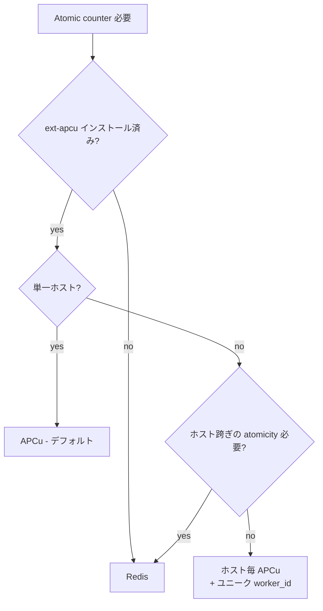
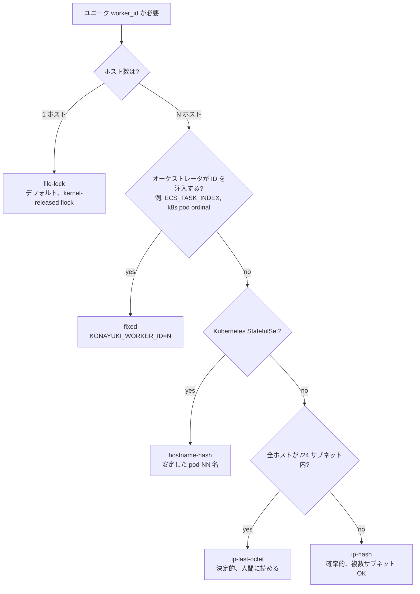

# Konayuki

[](LICENSE)
[](composer.json)
[](composer.json)

[English](README.md) | **日本語**

> 粉雪 (konayuki) — *粉のような雪*。一片一片は小さいが、ユニークで、大量に降る。

ヘキサゴナル設計の **63-bit Snowflake ID ジェネレータ**。カウンタバックエンド（APCu / File / Redis）、`worker_id` 戦略（FileLock / Fixed / IP-based / Hostname-hash）、タイムスタンプ戦略をすべて差し替え可能。すべて `.env` と `config/konayuki.php` で制御できる。

- **2.4M+ IDs / 秒** — APCu バックエンドの単一プロセスで実測
- **63-bit が PHP の符号付き `int` に収まる** — JSON / MySQL `BIGINT` で安全
- **k-sortable** — タイムスタンプ先頭、インデックス効率良好
- **8 プロセス × 10K ID で衝突 0** — CI で実測

> ## ⚠️ **複数ホスト**にデプロイする前に必ず読むこと
>
> `worker_id` のデフォルト戦略は **`file-lock`** で、これは **単一ホストでのみ安全**。
>
> Web サーバを **2台以上** にスケールアウトする（5台、200台、1000台 ...）際にデフォルトのままにすると、**各ホストが独立に `worker_id=0, 1, 2...` を確保**し、全ホストの ID 空間が重なり、**ホスト跨ぎで Snowflake ID が重複する**。これはサイレントで、エラーは出ず、後日データベースで衝突が発見される。
>
> N ホスト（N ≥ 2）にデプロイする前に、**以下のいずれかを選ぶ**:
>
> | N ホスト | 推奨 | 理由 |
> |---|---|---|
> | 2–50 | `hostname-hash` または `fixed` | 安定、ホスト名が安定なら衝突 0 |
> | 50–500 | `fixed`（オーケストレータ注入）または `hostname-hash` | 同左、`fixed` は決定的 |
> | 500–1024 | `fixed` のみ — `KONAYUKI_MAX_WORKERS=1024` がハード上限 | ハッシュ系の衝突確率が許容外になる |
> | > 1024 | `worker_bits` を増やす（例: 12 bits → 4096 workers）→ `fixed` | 10 bits を使い切る |
>
> 詳細と `.env` スニペットは → [worker_id 戦略](#worker_id-戦略起動時の一意性)

---

## 目次

- [Quick Start](#quick-start)
- [設定マトリクス](#設定マトリクス--デプロイ形態から選ぶ)
- [並行処理モデル](#並行処理モデル--なぜ-next-が複数プロセスから安全か)
- [AtomicCounter（ID 生成ごとの原子性）](#atomiccounterid-生成ごとの原子性)
- [worker_id 戦略（起動時の一意性）](#worker_id-戦略起動時の一意性)
- [ビット配置](#ビット配置)
- [Epoch](#epoch)
- [タイムスタンプ戦略](#タイムスタンプ戦略)
- [ベンチマーク](#ベンチマーク)
- [なぜ Konayuki?](#なぜ-konayuki)
- [FAQ](#faq)

---

## Quick Start

```bash
composer require niktomo/konayuki
```

Laravel ではサービスプロバイダが auto-discovery される。デフォルト設定だけで **単一ホストの PHP-FPM / FrankenPHP / Octane** で即動作する：

```php
use Konayuki\Laravel\Facades\Konayuki;

$id = Konayuki::next();        // SnowflakeId
$id->toInt();                  // 7,123,456,789,012,345
$id->timestamp();              // 1,712,345,678,000 (ms)
$id->workerId();               // flock で自動割当
$id->sequence();               // 0..4095（ms 内）
```

デフォルト構成（`.env` 設定不要）：

| ポート | アダプタ | 動作 |
|---|---|---|
| `AtomicCounter` | **APCu** | 共有メモリカウンタ、~400 ns/ID |
| `WorkerIdAllocator` | **FileLock** | プロセス毎に kernel-released `flock` |
| `TimestampStrategy` | **Real** | wall-clock ms |
| `Clock` | **System** | `microtime(true)` |

---

## 設定マトリクス — デプロイ形態から選ぶ

**まず「ホスト数」で行を選び**、次にオーケストレーション方式で絞る。`.env` をコピーするだけ。

### 単一ホスト（1 台）

| 形態 | カウンタ | worker_id | `.env` |
|---|---|---|---|
| PHP-FPM / FrankenPHP / Octane | APCu | file-lock | *(空 — デフォルトで動く)* |
| 複数キューワーカー | APCu | file-lock | *(空)* |
| ローカルテスト（APCu なし） | file | file-lock | `KONAYUKI_COUNTER=file` |

### 複数ホスト（2–1024 台） — `file-lock` はここでは使えない

| 形態 | カウンタ | worker_id | `.env` |
|---|---|---|---|
| Kubernetes StatefulSet（安定 pod ordinal） | APCu | hostname-hash | `KONAYUKI_WORKER_ID_MODE=hostname-hash` |
| ECS / Nomad / オーケストレータが task index 注入 | APCu | fixed | `KONAYUKI_WORKER_ID_MODE=fixed`<br>`KONAYUKI_WORKER_ID=${ECS_TASK_INDEX}` |
| ベアメタル / VM、全ホストが単一 /24 サブネット | APCu | ip-last-octet | `KONAYUKI_WORKER_ID_MODE=ip-last-octet` |
| ベアメタル / VM、複数サブネット跨ぎ | APCu | ip-hash | `KONAYUKI_WORKER_ID_MODE=ip-hash` |
| APCu 不可コンテナ、複数ホスト | redis | hostname-hash | `KONAYUKI_COUNTER=redis`<br>`KONAYUKI_WORKER_ID_MODE=hostname-hash` |

### 超大規模（>1024 台）

10-bit `worker_id` は 1024 ワーカーで枯渇。次のいずれか:

1. `worker_bits` を 12 に拡張（4096 ワーカー） — sequence が 2 bit 減る；持続バースト容量が 4096 → 1024 IDs/ms/worker に低下
2. アプリ層でシャーディング（複数 Konayuki インスタンス、disjoint な `worker_id` 範囲）

完全な env リファレンスは [`config/konayuki.php`](config/konayuki.php) を参照。

---

## 並行処理モデル — なぜ `next()` が複数プロセスから安全か

Konayuki は **2 種類の "lock"** で **2 種類の異なる問題** を解いている。よく混同されるので、ここで明示的に区別する。

| | ① WorkerId flock | ② Sequence atomic inc |
|---|---|---|
| **いつ実行されるか** | プロセスごとに起動時 1 回 | **`next()` の呼び出しごと** |
| **何を守るか** | 各プロセスが *ユニークな `worker_id` スロット* を取る | (worker_id, ms) ごとの sequence が並行呼び出しでも単調に増える |
| **実装** | ロックファイルへの `flock(LOCK_EX \| LOCK_NB)`（プロセス終了時にカーネルが解放） | `apcu_inc()`（C 拡張レベルで atomic — PHP 側のロックなし） |
| **コード位置** | `FileLockWorkerIdAllocator::acquire()` | `ApcuAtomicCounter::increment()` |
| **コスト** | ~1.5 µs（1 回のみ） | ~400 ns / call |

### 両方が必要な理由

```
[プロセス A 起動]
  ├─ FileLock が worker_id=0 を確保   ← プロセス終了まで保持
  └─ next() → apcu_inc("seq:0:1234")  ← 呼び出しごとに実行
                       ↑
                       (このキーは A 専用 — worker_id=0)

[プロセス B 起動]
  ├─ FileLock が worker_id=1 を確保   ← プロセス終了まで保持（A と別スロット）
  └─ next() → apcu_inc("seq:1:1234")  ← 呼び出しごとに実行
                       ↑
                       (このキーは B 専用 — worker_id=1)
```

| もし以下を取り除くと... | 何が壊れるか |
|---|---|
| **WorkerId flock のみ削除** | 2 つのプロセスが両方とも `worker_id=0` を名乗る → 同じ APCu キー `seq:0:MS` を共有。atomic inc は serialize するが、**他ホストの同じコードが生成する同 (worker_id=0, ms, seq) と衝突**する。 |
| **Sequence atomic inc のみ削除** | 1 プロセス内でも 2 つの並行 `next()` がカウンタを読み、両方とも `5` を見て両方とも `6` を書く → 同 ms 内で sequence 重複。 |

> **TL;DR:** flock は「自分は誰か」（起動時の identity）を担当。`apcu_inc` は「次の番号は何か」（実行時の atomicity）を担当。両方が必要。互いを置き換えない。

`apcu_inc()` は **完全に複数プロセス安全**。APCu C 拡張内で atomic 操作として実装されている（ビルドにより pthread mutex / spinlock）。「ロック」は **PHP userland から不可視** で、ホットパスに syscall を増やさない。

---

## AtomicCounter（ID 生成ごとの原子性）

`AtomicCounter` は **ms 内の sequence カウンタ**。選択がスループット、プロセス再起動後の永続性、必要なインフラを決める。

### 比較

| アダプタ | スループット | レイテンシ | ロックスコープ | 再起動後保持? | 必要なもの |
|---|---|---|---|---|---|
| **APCu** *(デフォルト)* | **~2.5M IDs/秒** | ~400 ns | PHP マスタプロセス 1 つ | しない（インメモリ） | `ext-apcu` |
| **Redis** | ~12K IDs/秒 | ~86 µs | クラスタ全体 | する | Redis + `ext-redis` |
| **File** | ~800 IDs/秒 | ~1.2 ms | ホスト全体（`flock`） | する | ローカル FS |

### いつ切り替えるか



**APCu + ホスト毎 worker_id** の組み合わせが本番のスイートスポット。各ホストが自前の APCu カウンタを持ち（ネットワークホップなし）、ユニーク `worker_id` がホスト跨ぎの衝突を構造的に不可能にする。

### `.env` 例

```dotenv
# デフォルト（APCu）— env 不要
# KONAYUKI_COUNTER=apcu

# Redis に切替
KONAYUKI_COUNTER=redis
REDIS_HOST=127.0.0.1
REDIS_PORT=6379

# ファイルに切替（テスト用 — 極めて遅い）
KONAYUKI_COUNTER=file
KONAYUKI_COUNTER_FILE_DIR=/tmp/konayuki
```

> **注意:** `KONAYUKI_COUNTER` の切替は `config/konayuki.php` で配線する。古いコピーを fork している場合は `counter` ブロックの存在を確認すること。

### APCu サイジング (`apc.shm_size`)

Konayuki 自体は ≪ 2 MB しか使わない。サイジングは同居者次第：

| 同居者 | 推奨 `apc.shm_size` |
|---|---|
| Konayuki のみ | **32 MB**（デフォルト） |
| + Laravel `cache.driver=apc` | 128 MB |
| + マスタデータキャッシュ（50–500 MB） | マスタサイズ × 2 |

```ini
; php.ini
apc.shm_size = 128M
apc.enable_cli = 1
```

---

## worker_id 戦略（起動時の一意性）

`worker_id` は **動作中のプロセス / ホストのユニーク識別子**。すべての ID にこれが埋め込まれる。**戦略の誤選択がホスト間の重複 ID 発生原因のトップ。**

> ## ⚠️ `file-lock` は単一ホスト専用
>
> `file-lock`（デフォルト）は **1 ホストのファイルシステム内** で `worker_id` スロットを調整する。2 つのホストは互いのロックファイルを見られないため:
>
> ```
> [Host A] file-lock → worker_id = 0   ┐
> [Host B] file-lock → worker_id = 0   ├── 全ホストが独立に 0 から開始
> [Host C] file-lock → worker_id = 0   ┘     → ID 空間が完全に重複
>                                            → ホスト跨ぎで Snowflake 衝突
> ```
>
> **症状**: エラーなし、警告なし — `BIGINT` PK の重複がデータベースにサイレントに発生し、しばしば数週間後に unique 制約違反で初めて発見される。
>
> **原則**: Web/App サーバが ≥ 2 台あるなら、**`KONAYUKI_WORKER_ID_MODE` を `fixed`、`hostname-hash`、`ip-hash`、`ip-last-octet` のいずれかに変更すること**。

> **再掲（[並行処理モデル](#並行処理モデル--なぜ-next-が複数プロセスから安全か) を参照）**: ここで紹介する戦略は **起動時に 1 回** だけ走り `worker_id` を `int` に解決する。その後 `IdGenerator` は単に int をフィールドに持つだけ — どの戦略を選んでも `next()` ごとのコストは **0**。呼び出しごとの atomicity は別途 `AtomicCounter` が担当する。

### 意思決定フローチャート



### 5 つのモード

#### 1. `file-lock` *(デフォルト — 単一ホスト)*

各 PHP プロセスが `flock` で次の空きスロットを atomic に確保する。プロセス終了時にカーネルがロックを解放するため、クラッシュや `kill -9` でもスロットがリークしない。

```dotenv
# .env（または空のまま — これがデフォルト）
KONAYUKI_WORKER_ID_MODE=file-lock
KONAYUKI_LOCK_DIR=/var/www/storage/konayuki   # 任意、デフォルトは storage_path('konayuki')
KONAYUKI_MAX_WORKERS=1024                     # worker_bits に収まる必要あり（デフォルト 10 = 1024）
```

**使うとき:** 単一ホスト、複数プロセス（PHP-FPM ワーカー、キューワーカー、cron）。
**使わないとき:** 複数ホスト — 各ホストが独立に worker_id=0, 1, 2... を確保 → 衝突確定。

> **パフォーマンス補足:** `acquire()` は **プロセス起動時に 1 回** だけ走る（`IdGenerator` 構築時）、ID ごとではない。実測コスト: **~1.5 µs / 起動**（[ベンチマーク](#ベンチマーク) 参照）。起動後、`worker_id` はただの `int` フィールド — `next()` ではコスト 0。

#### 2. `fixed` *(オーケストレータ注入)*

呼び出し側（Kubernetes / ECS / Nomad / CI）が env で一意性を保証した ID を注入する。

```dotenv
KONAYUKI_WORKER_ID_MODE=fixed
KONAYUKI_WORKER_ID=7    # オーケストレータが提供する値
```

**使うとき:** ECS `ECS_TASK_INDEX`、k8s StatefulSet ordinal（`hostname` が `-N` で終わる）、その他インスタンス毎に数値インデックスを与えるシステム。
**使わないとき:** 値が実際にはユニークでない場合（例: 2 つの pod が共有 ConfigMap から同じ `WORKER_ID=0` を読む）。

#### 3. `ip-last-octet` *(決定的、/24 限定)*

ホストの primary IPv4 の最終オクテットを `worker_id` として使う。

```dotenv
KONAYUKI_WORKER_ID_MODE=ip-last-octet
KONAYUKI_MAX_WORKERS=1024     # 256 以上必須（最終オクテットの範囲）
KONAYUKI_IP_OVERRIDE=10.0.0.7 # 任意 — デフォルトは自動検出した primary IP
```

**使うとき:** 全ホストが単一 `/24` サブネット（あるいはより小さなサブネット）を共有する場合。
**絶対に使ってはいけないとき:** ホストが複数サブネットに跨る — `10.0.0.17` と `10.0.1.17` が両方 `worker_id=17` で衝突 → ID 衝突。

#### 4. `ip-hash` *(確率的、複数サブネット)*

`crc32(primary_ip) % max_workers` でハッシュ。IPv4 / IPv6 両対応。

```dotenv
KONAYUKI_WORKER_ID_MODE=ip-hash
KONAYUKI_MAX_WORKERS=1024
KONAYUKI_IP_OVERRIDE=10.0.5.42  # 任意
```

**使うとき:** 複数ホスト、複数サブネット、オーケストレータ注入が使えない場合。
**衝突確率:** おおよそ N²/(2·max_workers)。8 ホスト + `max_workers=1024` で *いずれか* のペアが衝突する確率 ~3%。スケール時は `max_workers` を増やす（または `fixed` に格上げ）。

#### 5. `hostname-hash` *(Kubernetes StatefulSet)*

`crc32(gethostname()) % max_workers` でハッシュ。ホスト名が安定していれば結果も安定。

```dotenv
KONAYUKI_WORKER_ID_MODE=hostname-hash
KONAYUKI_MAX_WORKERS=1024
KONAYUKI_HOSTNAME_OVERRIDE=app-3   # 任意、主にテスト用
```

**使うとき:** Kubernetes StatefulSet（pod が安定した `name-0`, `name-1` ordinal を持つ）、ホスト名が安定したオンプレ。
**絶対に使ってはいけないとき:** Docker のデフォルトランダムホスト名（例: `7f3a2b1c4d`）— 再起動ごとに新しい `worker_id` になり、戦略の意味を失う。

### 共通の worker_id env キー

| Env | デフォルト | 使われる場所 |
|---|---|---|
| `KONAYUKI_WORKER_ID_MODE` | `file-lock` | 全モード |
| `KONAYUKI_MAX_WORKERS` | `1024` | 全モード（`worker_bits` に収まる必要あり） |
| `KONAYUKI_WORKER_ID` | — | `fixed` のみ |
| `KONAYUKI_LOCK_DIR` | `storage/konayuki` | `file-lock` のみ |
| `KONAYUKI_IP_OVERRIDE` | 自動検出 | `ip-last-octet`, `ip-hash` |
| `KONAYUKI_HOSTNAME_OVERRIDE` | `gethostname()` | `hostname-hash` |

---

## ビット配置

```
| 1 sign bit (0) | 41 bits timestamp (ms) | 10 bits worker_id | 12 bits sequence |
```

- **41 bits timestamp** → カスタム epoch から ~69.7 年
- **10 bits worker_id** → 1024 ユニークワーカー
- **12 bits sequence** → 4096 IDs / ms / worker

合計は **63 必須**（1 sign bit 予約）。`config/konayuki.php` でカスタマイズ可能：

```php
'layout' => [
    'timestamp_bits' => 41,
    'worker_bits'    => 10,
    'sequence_bits'  => 12,
],
```

トレードオフ：

| こうしたい... | 増やす | 減らす |
|---|---|---|
| ワーカー数を増やす（>1024） | `worker_bits` | `sequence_bits` |
| バースト > 4096/ms/worker | `sequence_bits` | `worker_bits` |
| 70 年以上の寿命 | `timestamp_bits` | 他のいずれか |

---

## Epoch

41-bit timestamp は **カスタム epoch からの相対時刻**（Unix epoch ではない）。デフォルト: `2026-01-01 00:00:00 UTC`。

```dotenv
KONAYUKI_EPOCH_MS=1767225600000   # 2026-01-01 UTC（デフォルト）
```

**運用ルール**（ADR-0015 由来）：

1. epoch はプロジェクトリリース日 ≤ にする — 早すぎると寿命を浪費する。
2. **デプロイ後は epoch を変更しない** — 過去の ID が誤った時刻にデコードされる。
3. **全環境で同じ epoch**（dev / staging / prod）— 環境跨ぎの比較に必須。
4. **システムクロックを巻き戻さない** — Snowflake は ms の単調増加を前提。巻き戻しは重複 ID を生む。

---

## タイムスタンプ戦略

```dotenv
KONAYUKI_TIMESTAMP_MODE=real        # 本番（デフォルト）
# KONAYUKI_TIMESTAMP_MODE=jittered  # ローカル開発のみ — k-sortable 順序が壊れる！
# KONAYUKI_JITTER_MS=100            # ± ランダムオフセット
```

- `real`: wall-clock ms。本番で使う。
- `jittered`: wall-clock ± random(0..jitter_ms)。**ローカル開発のみ** — トラフィックが少ない時のシャード分散用。k-sortable 順序が壊れる。

---

## ベンチマーク

Docker (PHP 8.4, APCu) on Apple Silicon で実測：

| ベンチマーク | 結果 |
|---|---|
| スループット（単一プロセス） | **2,426,113 IDs/sec** |
| レイテンシ p50 | 416 ns |
| レイテンシ p99 | 542 ns |
| レイテンシ p999 | 625 ns |
| 衝突ストレス（8 procs × 10K） | **重複 0** |

アダプタ比較（各 50K IDs）：

| アダプタ | IDs/sec | ns/ID |
|---|---|---|
| APCu | 2,535,657 | 394 |
| Redis | 11,621 | 86,047 |
| File | 813 | 1,230,011 |

WorkerIdAllocator 起動時コスト（`acquire()` は **プロセス毎に 1 回** だけ実行 — ID ごとではない）：

| Allocator | mean | p50 | p99 |
|---|---|---|---|
| `fixed` | 92 ns | 83 ns | 125 ns |
| `ip-hash` | 136 ns | 125 ns | 167 ns |
| `hostname-hash` | 177 ns | 167 ns | 209 ns |
| `ip-last-octet` | 193 ns | 167 ns | 250 ns |
| `file-lock` | **1.5 µs** | 1.5 µs | 2.0 µs |

`file-lock` はヒント系 allocator より ~10× 遅いが、それでも **1.5 µs / 起動** — 一般的な PHP-FPM / Octane のリクエストレイテンシ（>1 ms）と比べれば不可視。起動後は 5 つの allocator すべて同じランタイムコスト: **0**（解決済みの `worker_id` は `IdGenerator` のただの `int` フィールド）。

自分で実行：

```bash
docker compose run --rm bench
```

---

## なぜ Konayuki?

| | konayuki | godruoyi/php-snowflake | godruoyi/php-id-generator |
|---|---|---|---|
| ヘキサゴナル ports | ✅ 4 ports | ❌ | ❌ |
| APCu 共有メモリカウンタ | ✅ デフォルト | ❌（ファイルシステム） | ❌ |
| 差替可能な worker_id | ✅ 5 戦略 | ⚠️ env のみ | ⚠️ env のみ |
| `2.4M+ IDs/sec` | ✅ 実測 | ⚠️ ~50K（ファイルシステム） | n/a |
| APCu wipe 検出 | ✅ sentinel ベース | ❌ | ❌ |
| プロセス間衝突を CI でテスト | ✅ | ❌ | ❌ |
| カスタム epoch | ✅ | ✅ | ⚠️ Unix のみ |

---

## FAQ

### 63-bit ID を JavaScript に送って大丈夫?

**大丈夫、ただし string で serialize すること。** JS の `Number.MAX_SAFE_INTEGER` は `2^53 - 1`。Snowflake ID は `2^62` まで届く。常に JSON 文字列として送る：

```php
'id' => (string) $id->toInt(),
```

### なぜデフォルトが Redis ではなく APCu?

- 200× 高速（ネットワークホップなし）
- 追加インフラ不要
- ホスト毎 APCu + ユニーク `worker_id` は構造的に衝突 0

ホスト跨ぎの atomicity が真に必要なときだけ Redis に切替（ID 生成では稀）。

### APCu が wipe された場合（サーバ再起動、OOM 等）どうなる?

Konayuki は sentinel キーで検知する（`apcu_add` はキー作成時のみ true を返す）。検知時は 1 ms スリープしてから続行 — wipe 前の ID と同じミリ秒に新しい sequence が衝突しないことを保証する。

### Laravel なしで使える?

使える。`Konayuki\Laravel\` 名前空間はオプトイン。`IdGenerator` を直接構築：

```php
use Konayuki\IdGenerator;
use Konayuki\Apcu\ApcuAtomicCounter;
use Konayuki\SystemClock;
use Konayuki\Layout;
use Konayuki\RealTimestamp;

$generator = new IdGenerator(
    counter: new ApcuAtomicCounter(),
    clock: new SystemClock(),
    layout: new Layout(epochMs: 1_767_225_600_000),
    timestamp: new RealTimestamp(),
    workerId: 0,
);
```

### 問題の診断は?

```bash
vendor/bin/konayuki-doctor
```

PHP バージョン、APCu、ロックタイプ、`apcu_inc` 正常性、利用可能メモリ、`flock` サポートをチェックする。

---

## Contributing

```bash
docker compose run --rm app    # 全 QA: pint + phpstan + tests + doctor + bench
docker compose run --rm test   # tests のみ
docker compose run --rm stan   # PHPStan lv8 のみ
docker compose run --rm bench  # benchmark のみ
```

## License

MIT
