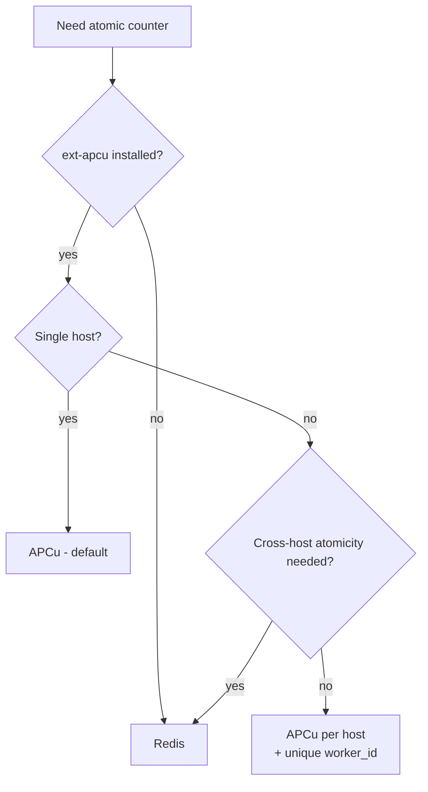
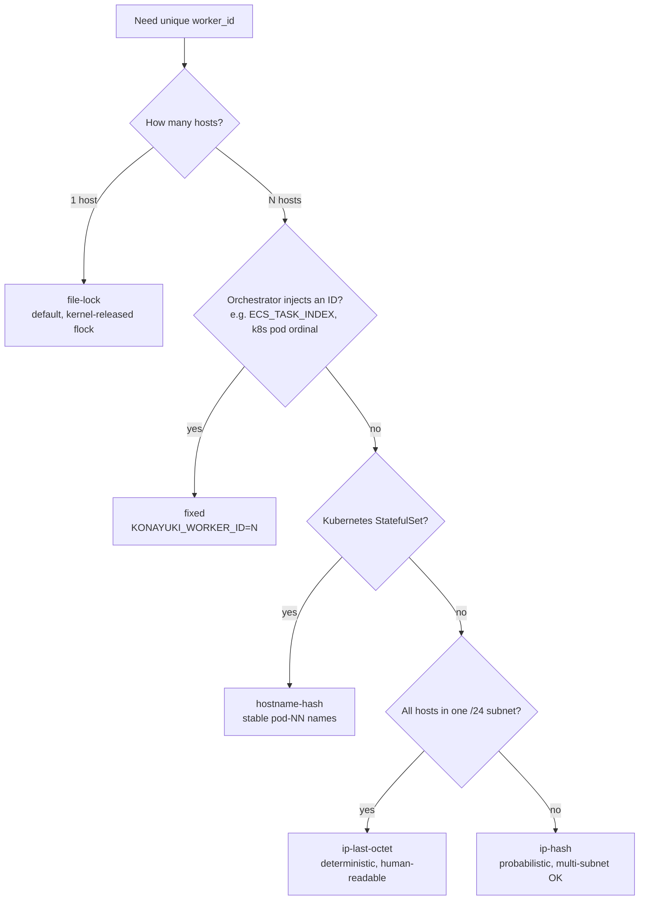

# Konayuki

[](LICENSE)
[](composer.json)
[](composer.json)

**English** | [日本語](README-ja.md)

> 粉雪 (konayuki) — *powdery snow*. Each flake is tiny, unique, and falls in vast quantities.

High-throughput **63-bit Snowflake ID generator** with a **Hexagonal architecture**: pluggable counter backends (APCu / File / Redis), pluggable `worker_id` strategies (FileLock / Fixed / IP-based / Hostname-hash), and pluggable timestamp strategies — all driven by `.env` and `config/konayuki.php`.

- **2.4M+ IDs / sec** on a single APCu-backed PHP process
- **63-bit fits inside PHP signed `int`** — safe for JSON, MySQL `BIGINT`, etc.
- **k-sortable** time-prefixed IDs (great for indexes)
- **Zero collisions** across 8 forked processes × 10K IDs in CI

> ## ⚠️ Read this before deploying to **multiple hosts**
>
> The default `worker_id` strategy is **`file-lock`**, which is safe for a **single host only**.
>
> If you scale out to **2 or more web servers** (5 hosts, 200 hosts, 1000 hosts, ...) and leave the default in place, **every host independently claims `worker_id=0, 1, 2...`**, all hosts produce overlapping ID space, and **you will get duplicate Snowflake IDs across hosts**. This is silent — there is no error message; you simply discover collisions in your database later.
>
> Before deploying to N hosts (N ≥ 2), **pick one of these strategies**:
>
> | N hosts | Recommended | Why |
> |---|---|---|
> | 2–50 | `hostname-hash` or `fixed` | Stable, no collision if hostnames stable |
> | 50–500 | `fixed` (orchestrator-injected) or `hostname-hash` | Same; `fixed` is deterministic |
> | 500–1024 | `fixed` only — `KONAYUKI_MAX_WORKERS=1024` is the hard cap | Hash strategies' collision probability becomes unacceptable |
> | > 1024 | Increase `worker_bits` first (e.g. 12 bits → 4096 workers), then `fixed` | 10 bits is exhausted |
>
> Jump to → [worker_id Strategy](#worker_id-strategy-boot-time-uniqueness) for full details and `.env` snippets.

---

## Table of Contents

- [Quick Start](#quick-start)
- [Configuration Matrix](#configuration-matrix-pick-your-shape)
- [Concurrency Model](#concurrency-model-what-makes-next-multi-process-safe)
- [AtomicCounter (per-ID atomicity)](#atomiccounter-per-id-atomicity)
- [worker_id Strategy (boot-time uniqueness)](#worker_id-strategy-boot-time-uniqueness)
- [Bit Layout](#bit-layout)
- [Epoch](#epoch)
- [Timestamp Strategy](#timestamp-strategy)
- [Benchmarks](#benchmarks)
- [Why Konayuki?](#why-konayuki)
- [FAQ](#faq)

---

## Quick Start

```bash
composer require niktomo/konayuki
```

Laravel auto-discovers the service provider. Out of the box, the defaults work for **single-host PHP-FPM / FrankenPHP / Octane**:

```php
use Konayuki\Laravel\Facades\Konayuki;

$id = Konayuki::next();        // SnowflakeId
$id->toInt();                  // 7,123,456,789,012,345
$id->timestamp();              // 1,712,345,678,000 (ms)
$id->workerId();               // auto-allocated via flock
$id->sequence();               // 0..4095 within ms
```

Default config (no `.env` needed):

| Port | Adapter | Behavior |
|---|---|---|
| `AtomicCounter` | **APCu** | shared-memory counter, ~400 ns/ID |
| `WorkerIdAllocator` | **FileLock** | kernel-released `flock` per process |
| `TimestampStrategy` | **Real** | wall-clock ms |
| `Clock` | **System** | `microtime(true)` |

---

## Configuration Matrix (pick your shape)

**Find your row by host count first**, then by orchestration. Copy the `.env`, done.

### Single host (1 host)

| Shape | Counter | worker_id | `.env` |
|---|---|---|---|
| PHP-FPM / FrankenPHP / Octane | APCu | file-lock | *(empty — defaults work)* |
| Multi-process queue workers | APCu | file-lock | *(empty)* |
| Local testing (no APCu) | file | file-lock | `KONAYUKI_COUNTER=file` |

### Multi-host (2–1024 hosts) — `file-lock` is unsafe here

| Shape | Counter | worker_id | `.env` |
|---|---|---|---|
| Kubernetes StatefulSet (stable pod ordinals) | APCu | hostname-hash | `KONAYUKI_WORKER_ID_MODE=hostname-hash` |
| ECS / Nomad / orchestrator gives task index | APCu | fixed | `KONAYUKI_WORKER_ID_MODE=fixed`<br>`KONAYUKI_WORKER_ID=${ECS_TASK_INDEX}` |
| Bare metal / VMs, all hosts in one /24 subnet | APCu | ip-last-octet | `KONAYUKI_WORKER_ID_MODE=ip-last-octet` |
| Bare metal / VMs across multiple subnets | APCu | ip-hash | `KONAYUKI_WORKER_ID_MODE=ip-hash` |
| Containers without APCu, multi-host | redis | hostname-hash | `KONAYUKI_COUNTER=redis`<br>`KONAYUKI_WORKER_ID_MODE=hostname-hash` |

### Very large fleets (>1024 hosts)

10-bit `worker_id` is exhausted at 1024 workers. Either:

1. Increase `worker_bits` to 12 (4096 workers) — costs you 2 bits of sequence; sustained burst capacity drops from 4096 to 1024 IDs / ms / worker
2. Use sharding at the application layer (multiple Konayuki instances with disjoint `worker_id` ranges)

Full env reference is in [`config/konayuki.php`](config/konayuki.php).

---

## Concurrency Model (what makes `next()` multi-process safe)

Konayuki uses **two different "locks"** that solve **two different problems**. They are easy to confuse — this section exists to make the distinction explicit.

| | ① WorkerId flock | ② Sequence atomic inc |
|---|---|---|
| **When it runs** | Once per process, at boot | **Every call to `next()`** |
| **What it protects** | Each process gets a *unique `worker_id` slot* | The per-(worker_id, ms) sequence stays monotonic across concurrent calls |
| **Implementation** | `flock(LOCK_EX \| LOCK_NB)` on a lock file (kernel-released on process exit) | `apcu_inc()` (atomic at the C-extension level — no PHP-side lock) |
| **Where to find it** | `FileLockWorkerIdAllocator::acquire()` | `ApcuAtomicCounter::increment()` |
| **Cost** | ~1.5 µs once | ~400 ns per call |

### Why both are needed

```
[Process A boot]
  ├─ FileLock acquires worker_id=0   ← held until process exit
  └─ next() → apcu_inc("seq:0:1234")  ← runs every call
                       ↑
                       (this key belongs only to A — worker_id=0)

[Process B boot]
  ├─ FileLock acquires worker_id=1   ← held until process exit (different slot from A)
  └─ next() → apcu_inc("seq:1:1234")  ← runs every call
                       ↑
                       (this key belongs only to B — worker_id=1)
```

| If you removed... | What breaks |
|---|---|
| **WorkerId flock only** | Two processes both think they're `worker_id=0`, so they share APCu key `seq:0:MS`. Atomic inc still serializes them, but the resulting Snowflake IDs `(worker_id=0, ms, seq)` collide because the IDs are identical to processes on *other* hosts running the same code. |
| **Sequence atomic inc only** | Even within one process, two concurrent `next()` calls could read the counter, both see `5`, both write `6` → duplicate sequence within the same ms. |

> **TL;DR:** flock is for "who am I" (boot-time identity). `apcu_inc` is for "what's the next number" (runtime atomicity). Both are required; neither replaces the other.

`apcu_inc()` is **fully multi-process safe** — it's implemented as an atomic operation in the APCu C extension (backed by a pthread mutex or spinlock depending on build). The "lock" is **invisible from PHP userland** and adds no syscall on the fast path.

---

## AtomicCounter (per-ID atomicity)

`AtomicCounter` is the **per-millisecond sequence counter**. The choice determines throughput, durability after process restart, and what infrastructure must be running.

### Comparison

| Adapter | Throughput | Latency | Lock scope | Survives restart? | Requires |
|---|---|---|---|---|---|
| **APCu** *(default)* | **~2.5M IDs/sec** | ~400 ns | one PHP master process | no (in-memory) | `ext-apcu` |
| **Redis** | ~12K IDs/sec | ~86 µs | cluster-wide | yes | Redis + `ext-redis` |
| **File** | ~800 IDs/sec | ~1.2 ms | host-wide (`flock`) | yes | local FS |

### When to switch



The **APCu + per-host worker_id** combination is the production sweet spot: each host runs its own APCu counter (no network hop), and the unique `worker_id` makes cross-host collisions impossible by construction.

### `.env` examples

```dotenv
# Default (APCu) — no env needed
# KONAYUKI_COUNTER=apcu

# Switch to Redis
KONAYUKI_COUNTER=redis
REDIS_HOST=127.0.0.1
REDIS_PORT=6379

# Switch to file-based (testing only — extremely slow)
KONAYUKI_COUNTER=file
KONAYUKI_COUNTER_FILE_DIR=/tmp/konayuki
```

> **Note:** `KONAYUKI_COUNTER` switching is wired in `config/konayuki.php`. If you forked an older copy, ensure the `counter` block is present.

### APCu sizing (`apc.shm_size`)

Konayuki itself uses ≪ 2 MB. Sizing depends on co-tenants in the same APCu segment:

| Co-tenant | Recommended `apc.shm_size` |
|---|---|
| Konayuki only | **32 MB** (default) |
| + Laravel `cache.driver=apc` | 128 MB |
| + master-data caches (50–500 MB) | master size × 2 |

```ini
; php.ini
apc.shm_size = 128M
apc.enable_cli = 1
```

---

## worker_id Strategy (boot-time uniqueness)

`worker_id` is the **unique identifier for the running process / host** that gets baked into every ID. Picking the wrong strategy is the **#1 cause of duplicate IDs across hosts**.

> ## ⚠️ `file-lock` is single-host only
>
> `file-lock` (the default) coordinates `worker_id` slots **within one host's filesystem**. Two hosts cannot see each other's lock files, so:
>
> ```
> [Host A] file-lock → worker_id = 0   ┐
> [Host B] file-lock → worker_id = 0   ├── all hosts independently start at 0
> [Host C] file-lock → worker_id = 0   ┘     → ID space fully overlaps
>                                            → Snowflake collisions across hosts
> ```
>
> **Symptom**: no errors, no warnings — duplicate `BIGINT` PKs appear silently in your database, often noticed weeks later when a unique constraint finally trips.
>
> **Rule of thumb**: if you have ≥ 2 web/app servers, **change `KONAYUKI_WORKER_ID_MODE` to one of `fixed`, `hostname-hash`, `ip-hash`, or `ip-last-octet`**.

> **Reminder (see [Concurrency Model](#concurrency-model-what-makes-next-multi-process-safe))**: the strategy below runs **once at boot** to resolve `worker_id` to an `int`. After that, `IdGenerator` just stores the int as a field — there is **no per-`next()` cost** regardless of which strategy you pick. The per-call atomicity is handled separately by `AtomicCounter`.

### Decision flowchart



### All 5 modes

#### 1. `file-lock` *(default — single host)*

Each PHP process atomically claims the next free slot via `flock`. The kernel releases the lock on process exit, so crashes / `kill -9` cannot leak slots.

```dotenv
# .env (or just leave empty — this is the default)
KONAYUKI_WORKER_ID_MODE=file-lock
KONAYUKI_LOCK_DIR=/var/www/storage/konayuki   # optional, defaults to storage_path('konayuki')
KONAYUKI_MAX_WORKERS=1024                     # must fit worker_bits (default 10 = 1024)
```

**Use when:** one host, multi-process (PHP-FPM workers, queue workers, cron).
**Do not use when:** multiple hosts — each host would independently claim worker_id=0, 1, 2... → guaranteed collision.

> **Performance note:** `acquire()` runs **once per process at boot** (when `IdGenerator` is constructed), not per ID. Measured cost: **~1.5 µs / boot** (see [Benchmarks](#benchmarks)). After boot, `worker_id` is a plain `int` field — zero cost on `next()`.

#### 2. `fixed` *(orchestrator-injected)*

The caller (Kubernetes / ECS / Nomad / CI) injects a guaranteed-unique ID via env.

```dotenv
KONAYUKI_WORKER_ID_MODE=fixed
KONAYUKI_WORKER_ID=7    # whatever your orchestrator provides
```

**Use when:** ECS `ECS_TASK_INDEX`, k8s StatefulSet ordinal (`hostname` ends in `-N`), or any system that gives each instance a numeric index.
**Do not use when:** the value is not actually unique (e.g. two pods both reading `WORKER_ID=0` from a shared ConfigMap).

#### 3. `ip-last-octet` *(deterministic, /24 only)*

Uses the last octet of the host's primary IPv4 as `worker_id`.

```dotenv
KONAYUKI_WORKER_ID_MODE=ip-last-octet
KONAYUKI_MAX_WORKERS=1024     # must be >= 256 (last octet range)
KONAYUKI_IP_OVERRIDE=10.0.0.7 # optional — defaults to auto-detected primary IP
```

**Use when:** all hosts share a single `/24` subnet (or smaller).
**DO NOT USE when:** hosts span multiple subnets — `10.0.0.17` and `10.0.1.17` collide on `worker_id=17` → ID collision.

#### 4. `ip-hash` *(probabilistic, multi-subnet)*

Hashes `crc32(primary_ip) % max_workers`. Works for IPv4 and IPv6.

```dotenv
KONAYUKI_WORKER_ID_MODE=ip-hash
KONAYUKI_MAX_WORKERS=1024
KONAYUKI_IP_OVERRIDE=10.0.5.42  # optional
```

**Use when:** multi-host, multi-subnet, no orchestrator injection available.
**Collision probability:** roughly N²/(2·max_workers). At 8 hosts with `max_workers=1024`, ~3% chance of *any* pair colliding. Increase `max_workers` (or upgrade to `fixed`) when at scale.

#### 5. `hostname-hash` *(Kubernetes StatefulSet)*

Hashes `crc32(gethostname()) % max_workers`. Stable when hostnames are stable.

```dotenv
KONAYUKI_WORKER_ID_MODE=hostname-hash
KONAYUKI_MAX_WORKERS=1024
KONAYUKI_HOSTNAME_OVERRIDE=app-3   # optional, mainly for testing
```

**Use when:** Kubernetes StatefulSet (pods get stable `name-0`, `name-1` ordinals), on-prem with stable hostnames.
**DO NOT USE when:** Docker default randomized hostnames (e.g. `7f3a2b1c4d`) — every restart gives a new `worker_id`, defeating the point.

### Common worker_id env keys

| Env | Default | Used by |
|---|---|---|
| `KONAYUKI_WORKER_ID_MODE` | `file-lock` | all modes |
| `KONAYUKI_MAX_WORKERS` | `1024` | all modes (must fit `worker_bits`) |
| `KONAYUKI_WORKER_ID` | — | `fixed` only |
| `KONAYUKI_LOCK_DIR` | `storage/konayuki` | `file-lock` only |
| `KONAYUKI_IP_OVERRIDE` | auto-detect | `ip-last-octet`, `ip-hash` |
| `KONAYUKI_HOSTNAME_OVERRIDE` | `gethostname()` | `hostname-hash` |

---

## Bit Layout

```
| 1 sign bit (0) | 41 bits timestamp (ms) | 10 bits worker_id | 12 bits sequence |
```

- **41 bits timestamp** → ~69.7 years from custom epoch
- **10 bits worker_id** → 1024 unique workers
- **12 bits sequence** → 4096 IDs per ms per worker

Sum **must equal 63** (1 sign bit reserved). Customize via `config/konayuki.php`:

```php
'layout' => [
    'timestamp_bits' => 41,
    'worker_bits'    => 10,
    'sequence_bits'  => 12,
],
```

Trade-offs:

| If you have... | Increase | Decrease |
|---|---|---|
| Many workers (>1024) | `worker_bits` | `sequence_bits` |
| Burst > 4096/ms/worker | `sequence_bits` | `worker_bits` |
| Need >70 yr lifespan | `timestamp_bits` | one of the others |

---

## Epoch

The 41-bit timestamp is **relative to a custom epoch** (not Unix epoch). Default: `2026-01-01 00:00:00 UTC`.

```dotenv
KONAYUKI_EPOCH_MS=1767225600000   # 2026-01-01 UTC (default)
```

**Operational rules** (from ADR-0015):

1. Choose epoch ≥ project release date — earlier wastes lifespan.
2. **Never change epoch after deploy** — past IDs would re-decode to wrong timestamps.
3. **Same epoch in all environments** (dev/staging/prod) — required for cross-env comparisons.
4. **Never rewind the system clock** — Snowflake assumes monotonic ms; rewinds can produce duplicate IDs.

---

## Timestamp Strategy

```dotenv
KONAYUKI_TIMESTAMP_MODE=real        # production (default)
# KONAYUKI_TIMESTAMP_MODE=jittered  # local dev only — breaks k-sortable!
# KONAYUKI_JITTER_MS=100            # ± random offset
```

- `real`: wall-clock ms. Use in production.
- `jittered`: wall-clock ± random(0..jitter_ms). **Local dev only** — designed for sparse-traffic shard distribution. Breaks k-sortable ordering.

---

## Benchmarks

Measured in Docker (PHP 8.4, APCu) on Apple Silicon:

| Benchmark | Result |
|---|---|
| Throughput (single process) | **2,426,113 IDs/sec** |
| Latency p50 | 416 ns |
| Latency p99 | 542 ns |
| Latency p999 | 625 ns |
| Collision stress (8 procs × 10K) | **0 duplicates** |

Adapter comparison (50K IDs each):

| Adapter | IDs/sec | ns/ID |
|---|---|---|
| APCu | 2,535,657 | 394 |
| Redis | 11,621 | 86,047 |
| File | 813 | 1,230,011 |

WorkerIdAllocator boot-time cost (`acquire()` runs **once per process** at `IdGenerator` construction — not per ID):

| Allocator | mean | p50 | p99 |
|---|---|---|---|
| `fixed` | 92 ns | 83 ns | 125 ns |
| `ip-hash` | 136 ns | 125 ns | 167 ns |
| `hostname-hash` | 177 ns | 167 ns | 209 ns |
| `ip-last-octet` | 193 ns | 167 ns | 250 ns |
| `file-lock` | **1.5 µs** | 1.5 µs | 2.0 µs |

`file-lock` is ~10× slower than the hint-based allocators because it actually opens a file and calls `flock`, but at **1.5 µs / boot** it is invisible compared to typical PHP-FPM / Octane request latency (>1 ms). After boot, all five allocators have the same runtime cost: **zero** (the resolved `worker_id` is just an `int` field on `IdGenerator`).

Run all benchmarks yourself:

```bash
docker compose run --rm bench
```

---

## Why Konayuki?

| | konayuki | godruoyi/php-snowflake | godruoyi/php-id-generator |
|---|---|---|---|
| Hexagonal ports | ✅ 4 ports | ❌ | ❌ |
| APCu shared-memory counter | ✅ default | ❌ (filesystem) | ❌ |
| Pluggable worker_id | ✅ 5 strategies | ⚠️ env only | ⚠️ env only |
| `2.4M+ IDs/sec` | ✅ measured | ⚠️ ~50K (filesystem) | n/a |
| APCu wipe detection | ✅ sentinel-based | ❌ | ❌ |
| Cross-process collision tested | ✅ in CI | ❌ | ❌ |
| Custom epoch | ✅ | ✅ | ⚠️ Unix only |

---

## FAQ

### What happens if I deploy the default `file-lock` to 200 web servers?

You get **silent duplicate IDs across hosts**. Each host independently runs its own FileLockWorkerIdAllocator, sees its own empty lock directory, and claims `worker_id=0` first. Hosts B, C, ... all do the same. Now hosts A, B, C all generate IDs as `worker_id=0`, and the (timestamp, worker_id, sequence) tuple is no longer globally unique → Snowflake collisions.

There is **no runtime error**. The collision rate depends on your write traffic and the number of hosts that hit the same millisecond. Symptoms surface later as:

- `Integrity constraint violation: 1062 Duplicate entry` on `BIGINT` PK inserts
- Inserts that should have failed silently overwriting due to upserts
- Foreign-key references suddenly pointing to wrong rows

**Fix**: set `KONAYUKI_WORKER_ID_MODE` to `fixed` / `hostname-hash` / `ip-hash` / `ip-last-octet` **before going to production**, and verify with `vendor/bin/konayuki-doctor` on each host.

### Are 63-bit IDs safe to send to JavaScript?

**Yes, but serialize as string.** JS `Number.MAX_SAFE_INTEGER` is `2^53 - 1`. Snowflake IDs reach `2^62`. Always send as JSON string:

```php
'id' => (string) $id->toInt(),
```

### Why APCu instead of Redis by default?

- 200× faster (no network hop)
- No additional infrastructure
- Per-host APCu + unique `worker_id` is collision-free by construction

Switch to Redis when you genuinely need cross-host atomicity (rare for ID generation).

### What happens if APCu gets wiped (server restart, OOM)?

Konayuki detects this via a sentinel key (`apcu_add` returns true only on key creation). On detection, it sleeps 1 ms before continuing — guaranteeing the new sequence cannot collide with any pre-wipe ID in the same millisecond.

### Can I use this without Laravel?

Yes. The `Konayuki\Laravel\` namespace is opt-in. Construct `IdGenerator` directly:

```php
use Konayuki\IdGenerator;
use Konayuki\Apcu\ApcuAtomicCounter;
use Konayuki\SystemClock;
use Konayuki\Layout;
use Konayuki\RealTimestamp;

$generator = new IdGenerator(
    counter: new ApcuAtomicCounter(),
    clock: new SystemClock(),
    layout: new Layout(epochMs: 1_767_225_600_000),
    timestamp: new RealTimestamp(),
    workerId: 0,
);
```

### How do I diagnose problems?

```bash
vendor/bin/konayuki-doctor
```

Checks PHP version, APCu, locking type, `apcu_inc` correctness, available memory, `flock` support.

---

## Contributing

```bash
docker compose run --rm app    # full QA: pint + phpstan + tests + doctor + bench
docker compose run --rm test   # tests only
docker compose run --rm stan   # PHPStan lv8 only
docker compose run --rm bench  # benchmarks only
```

## License

MIT
